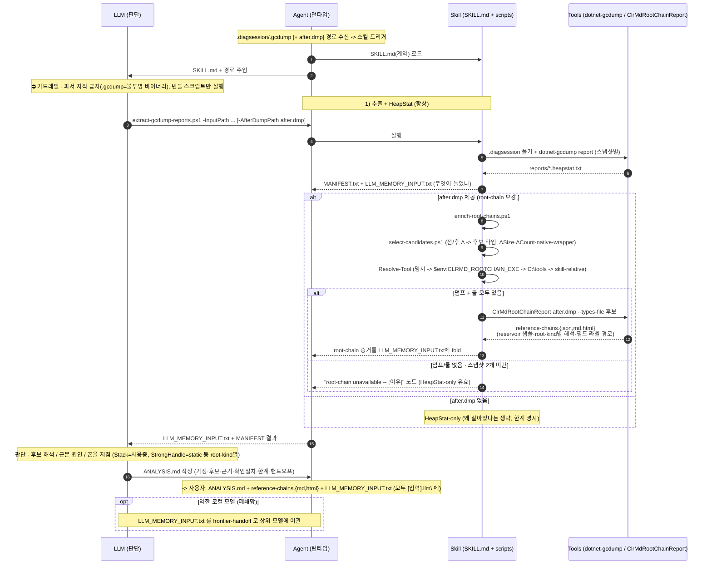

# diagsession-memory-analysis 사용 가이드

이 문서는 사람이 읽는 사용 가이드다. 에이전트가 런타임에 참고하는 지침은 `skills/diagsession-memory-analysis/SKILL.md`에 있고, 이 문서는 Claude Code에서 어떤 커맨드를 호출하고 어떤 정보를 함께 적어야 하는지 설명한다.

## 목적

Visual Studio 성능 프로파일러에서 생성한 `.diagsession` 또는 `.gcdump`를 분석해서 .NET managed heap 메모리 누수 후보를 찾는다.

Scope: analysis-only.

이 스킬은 분석 전용이다. 코드 수정, 패치, 커밋은 분석 결과의 handoff summary를 바탕으로 별도 세션이나 별도 작업에서 진행한다.

## Claude Code 설치

```text
/plugin marketplace add Peace-Min/peace-skillbank
/plugin install peace-skillbank@peace-skillbank
/reload-plugins
```

`/plugin install` 직후에는 커맨드가 현재 세션에 바로 등록되지 않을 수 있다. `/reload-plugins`를 실행하거나 Claude Code를 재시작한 뒤 사용한다.

이미 설치한 경우:

```text
/plugin marketplace update peace-skillbank
/plugin update peace-skillbank@peace-skillbank
/reload-plugins
```

## 기본 호출

plugin으로 설치한 경우 권장 호출은 namespace를 붙인 형태다.

```text
/peace-skillbank:diagsession-memory-analysis C:\dumps\leak-test.diagsession
```

plugin으로 설치한 커맨드는 항상 `peace-skillbank:` namespace로 등록된다. `/diagsession-memory-analysis`처럼 namespace 없는 짧은 형태는 plugin 설치만으로는 등록되지 않으므로 "등록된 커맨드가 없다"고 나온다. 짧은 형태가 필요하면 `commands/diagsession-memory-analysis.md`를 대상 환경의 `.claude/commands/`에 직접 복사해 개인 command로 둔다.

커맨드가 안 보이면 `/reload-plugins`를 먼저 실행하고, 그래도 없으면 `/plugin`에서 설치·활성(enabled) 상태와 Errors 탭을 확인한다.

## 권장 프롬프트

보통은 긴 체크리스트를 매번 붙이지 않는다. 파일 경로와 누수 재현 맥락만 짧게 적는다.

```text
/peace-skillbank:diagsession-memory-analysis C:\dumps\leak-test.diagsession

하나의 diagsession 안에 메모리 스냅샷 2개가 들어있다.
Snapshot 1 = 액션 반복 전
Snapshot 2 = 액션 반복 후

반복 액션: 장비 목록 새로고침
반복 횟수: 30회
코드 시작점: DeviceRefreshService.RefreshAsync
관련 파일/클래스: DeviceListViewModel, DeviceCache
```

최소 입력도 가능하다.

```text
/peace-skillbank:diagsession-memory-analysis C:\dumps\leak-test.diagsession

장비 목록 새로고침을 30회 반복한 뒤 찍은 스냅샷이다.
시작점은 DeviceRefreshService.RefreshAsync.
```

## 하나의 diagsession에 스냅샷이 여러 개 있는 경우

Visual Studio에서 같은 프로파일링 세션 안에서 스냅샷을 두 번 찍었다면 보통 하나의 `.diagsession` 안에 여러 `.gcdump` entry가 들어있다.

이 경우 사용자는 순서 의미를 알려주는 것이 좋다.

```text
Snapshot 1 = 반복 전
Snapshot 2 = 반복 후
```

스킬은 `.diagsession` 내부 `.gcdump`들을 추출하고 `MANIFEST.txt`에 archive entry 순서를 남긴다. 다만 dump 파일 자체만으로 "어떤 스냅샷이 before인지 after인지"를 항상 확정할 수는 없으므로, 사용자가 의도한 순서를 함께 적는 것이 가장 안전하다.

## gcdump 파일을 직접 넘기는 경우

`.gcdump` 자체를 넘겨도 된다.

```text
/peace-skillbank:diagsession-memory-analysis C:\dumps\snapshot1.gcdump C:\dumps\snapshot2.gcdump

Snapshot 1 = 반복 전
Snapshot 2 = 반복 후
```

하나의 `.gcdump`만 넘기면 단일 스냅샷 요약과 누수 의심 타입 분석까지만 가능하다. before/after 증가 비교는 두 개 이상의 스냅샷이 있어야 한다.

## 분석과 수정 분리

첫 세션에서는 분석만 요청한다.

```text
/peace-skillbank:diagsession-memory-analysis C:\dumps\leak-test.diagsession

반복 액션: ...
반복 횟수: ...
코드 시작점: ...
```

분석 결과의 handoff summary를 받은 뒤, 별도 세션이나 별도 요청에서 수정 작업을 시작한다.

```text
아래 memory analysis handoff summary를 기준으로 누수 후보를 코드에서 확인하고 수정해줘.

<handoff summary 붙여넣기>
```

## 결과물

스킬은 보통 다음 산출물을 기준으로 분석한다.

```text
LLM_MEMORY_INPUT.txt
MANIFEST.txt
reports/
ANALYSIS.md (분석 완료 후)
```

- `LLM_MEMORY_INPUT.txt`: LLM에 넘기기 좋은 요약 입력이다. 기본적으로 전체 로컬 경로는 제거된다.
- `MANIFEST.txt`: 원본 파일, 추출된 `.gcdump`, report 경로, archive entry 순서를 확인하는 파일이다.
- `reports/`: `dotnet-gcdump report` 결과가 저장된다.
- `ANALYSIS.md`: 분석 결과와 후속 수정 세션용 handoff summary가 저장되는 표준 파일이다.

외부 LLM에 넘기기 전에는 `LLM_MEMORY_INPUT.txt`를 먼저 검토한다. 타입명, 네임스페이스, 프로젝트명 자체가 민감 정보일 수 있다.

## 근본 원인 추적 (선택: root-chain 분석)

HeapStat은 "무엇이 늘었나"만 알려준다. "왜 회수되지 않나"(GC root / 참조 체인)까지 보려면 선택 단계인
`scripts/enrich-root-chains.ps1`를 추출 이후에 돌린다. 입력에 따라 **graceful**하게 동작한다.

```text
before/after report 2개            -> 후보 선정(성장 요약: ΔSize/ΔCount/both-app-owned/컨테이너/native 경계)
+ after.dmp + 빌드된 ClrMD 툴       -> 후보별 managed paths-to-root (reference-chains.{json,md,html})
.dmp나 툴이 없으면                  -> "root-chain unavailable" 안내 + HeapStat 후보만으로 진행
```

`.dmp` 캡처 표준:

```text
dotnet-dump collect -p <PID> --type heap -o after.dmp
```

root-chain 툴은 폐쇄망에선 **인터넷 PC에서 한 번 빌드한 self-contained exe를 반입**해 쓴다(빌드/번들 방법은
`skills/diagsession-memory-analysis/tools/ClrMdRootChainReport/README.md`). `Stack` root는 현재 사용 중(누수 아님)이고,
그 외 root는 **kind별로 다르게** 읽는다(리포트의 `rootInterpretation`): StrongHandle=static/장기 캐시(**static 필드는
`StrongHandle → Object[] → holder`로 나타남**, `Static` kind은 없음), PinnedHandle/AsyncPinnedHandle=pinning·interop·native
압력, FinalizerQueue=Dispose·finalizer 지연, RefCountedHandle=COM·interop 수명. unresolved(=max-depth/node-budget 초과 또는
unrooted)와 sampled(uniform reservoir) coverage는 불완전 증거로 본다. 멀티-GB 덤프는 메모리를 많이 쓰니(힙 크기 비례) RAM 여유 있는 PC에서 돌린다.

## 처리 흐름 (시퀀스)

두 단계 파이프라인이다: **① HeapStat(무엇이 늘었나)** 는 항상, **② root-chain(왜 살아있나)** 는 `after.dmp`+툴이 있을 때만 자동으로 붙는다. 어느 입력이 없어도 깨지지 않고 HeapStat-only로 graceful 폴백한다. `ANALYSIS.md`는 스크립트가 아니라 **모델이** 쓴다.



## 피해야 할 요청

다음처럼 매번 긴 내부 작업 목록을 직접 붙일 필요는 없다.

```text
1. diagsession 내부 gcdump들을 추출하고 ...
2. MANIFEST.txt 기준으로 ...
3. Snapshot 1과 Snapshot 2를 비교해서 ...
```

그 절차는 스킬과 command alias에 들어있다. 사람은 파일 경로, 스냅샷 의미, 반복 액션, 반복 횟수, 코드 시작점만 알려주면 된다.
