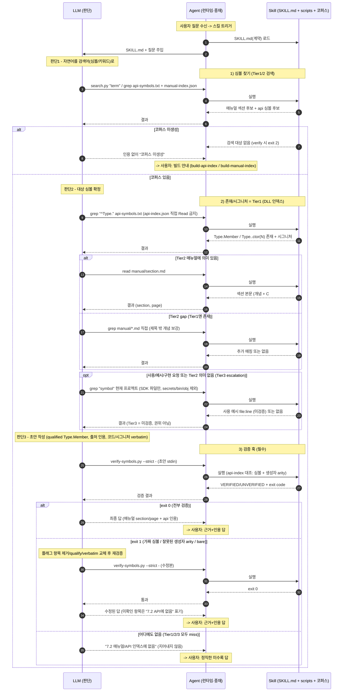

# lightningchart-72 사용 가이드

이 문서는 사람이 읽는 사용 가이드다. 에이전트가 런타임에 따르는 계약은
`skills/lightningchart-72/SKILL.md`에 있고, 여기서는 **스킬을 쓰기 전에 무엇을 준비해야 하는지**,
어떻게 호출하는지, 설정이 제대로 됐는지 어떻게 확인하는지를 설명한다.

## 목적

LightningChart Ultimate SDK **7.2**(Arction)의 API·프로퍼티·메서드·enum·사용법 질문에,
**로컬 7.2 소스에 근거해서만** 답한다. 출처를 인용하고, 소스에 없으면 "없다"고 말하며,
암기/일반지식으로 지어내지 않는다(폐쇄망 + 작은 로컬 모델에서 할루시네이션을 막는 게 목적).

근거는 3등급이다.

- **Tier 1 — DLL API 인덱스**: 타입·프로퍼티·메서드·enum·**생성자 arity** + 시그니처. *존재·시그니처의 권위.*
- **Tier 2 — 매뉴얼 청크**: 개념·how-to·의미. 큐레이션이라 **불완전**(수백 API 미수록).
- **Tier 3 — 프로젝트 코드**: 현재 작업 폴더의 실사용 예시. *미검증*(존재·시그니처를 증명하지 못함).

## 한 번만 하는 준비 (= 스킬 쓸 때 추가로 해야 하는 작업)

스킬 저장소에는 **스크립트(기계)만** 들어있다. **코퍼스(매뉴얼/DLL 인덱스)는 당신의 라이선스
원본으로 머신에서 직접 생성**하며 커밋되지 않는다(라이선스·프라이버시). 따라서 **스킬을 처음 쓰는
머신마다 1회**, 아래를 해야 한다.

### 1) 도구 준비

| 도구 | 용도 | 비고 |
|---|---|---|
| Windows PowerShell 5.1+ / .NET | DLL 리플렉션(`build-api-index.ps1`) | 별도 설치 불필요(PowerShell 내장 .NET 사용) |
| Python 3 + `pypdf` | 매뉴얼 청킹(`build-manual-index.py`) | `pip install pypdf` (폐쇄망은 오프라인 휠) |
| Python 3 | 런타임 검증 훅(`verify-symbols.py`) | 질의응답 시 사용 |
| Arction **7.2** SDK DLL | API 인덱스의 원본 | 당신 PC의 라이선스 DLL (배포 금지) |
| **7.2** User's Manual PDF | 매뉴얼 청크의 원본 | 당신 라이선스 PDF |

> `python`/`py`를 쓰고 **`python3`(Store stub)는 피한다.**

### 2) 코퍼스 생성 (스크립트 2개)

```powershell
# Tier 1: DLL -> api-index.json + api-symbols.txt (생성자 포함, Licensing 제외, 이름+시그니처만)
powershell -NoProfile -ExecutionPolicy Bypass -File skills/lightningchart-72/scripts/build-api-index.ps1 -DllDir "<...>\Lib\Arction"

# Tier 2: 매뉴얼 PDF -> 섹션 청크 + manual-index.json
python skills/lightningchart-72/scripts/build-manual-index.py "<...>\LightningChart Users Manual.pdf"
```

- `-DllDir`만 주면 메인 어셈블리(`*LightningChartUltimate*.dll`)를 **자동 탐지**한다.
- 산출물은 `skills/lightningchart-72/references/`(로컬, gitignore)에 생긴다.

### 3) 폐쇄망(air-gapped) 박스

스킬(스크립트)만 받은 뒤, **그 박스의 PDF·SDK로 위 2개를 다시 실행**해 코퍼스를 생성한다.
인덱스/매뉴얼/DLL은 그 박스 로컬에만 둔다.

### 4) (Phase 2, 선택) 공식 데모

매뉴얼+프로젝트로 부족하다고 판단되면, 공식 7.2 데모 소스를
`skills/lightningchart-72/references/demos/`에 넣는다(README 참고). 지금은 보류 권장.

## 설치 (Claude Code plugin)

```text
/plugin marketplace add Peace-Min/peace-skillbank
/plugin install peace-skillbank@peace-skillbank
/reload-plugins
```

## 호출

작업 폴더(스킬/프로젝트)를 연 세션에서 LightningChart 7.2 질문을 하면 된다. 짧게:

```text
/peace-skillbank:lightningchart-72

IntensityGridSeries에 value-range 색상 팔레트를 설정하는 코드 보여줘.
```

- 구현/예시를 원하면 작업 중인 프로젝트 폴더에서 호출한다(스킬이 그 프로젝트의 7.2 사용 코드를
  Tier 3로 참고). 별도로 데모를 붙일 필요는 없다.
- 매번 긴 지침을 붙일 필요 없다 — 절차는 SKILL.md에 들어있다.

## 처리 시퀀스 (LLM <-> Agent <-> Skill)

세 주체가 협업한다. **LLM**은 *판단*만 한다(검색어 결정 · 결과 선별 · 답 작성) — 파일을 직접 읽지
않는다. **Agent**(Claude Code 런타임)는 LLM의 도구 호출을 *실행*하고 결과를 다시 LLM에 넘긴다.
**Skill**은 *절차(SKILL.md) + 스크립트 + 로컬 코퍼스*다. LLM은 Skill을 직접 호출하지 않고
**Agent하고만** 대화하므로, 다이어그램은 LLM(좌) · Agent(중재, 가운데) · Skill(우)로 두고 사용자는
Agent를 경계로 접었다. 아래 시퀀스는 발생 가능한 모든 분기와 검증 훅(exit 0/1/2)을 포함한다.



**판단 지점**: (1) 자연어→검색어, (2) 대상 심볼 확정, (3) 초안 작성. 그 외는 Agent/Skill의 기계적 실행이다.

**핵심 분기·훅 요약**

- **Tier 1 (DLL 인덱스)** = 존재·시그니처·생성자 arity의 권위. `api-symbols.txt` grep으로 확인하고, 740KB짜리 `api-index.json`은 직접 Read하지 않는다(컨텍스트 폭발 방지; verify 훅만 파싱).
- **Tier 2 (매뉴얼)** = 의미. 제목/키워드 검색이 비면 `manual/*.md`를 직접 grep해 보강(없는 게 정상).
- **Tier 3 (프로젝트)** = 사용 예시. *미검증*이며 escalation(사용/예시 요청 또는 Tier2 의미 없음)에서만 본다. 존재는 절대 Tier3로 증명하지 않는다.
- **검증 훅** `verify-symbols.py --strict`: `exit 0`=전부 검증(단정 가능) / `exit 1`=가짜 심볼·잘못된 `new Type(...)` arity·bare 멤버 → 제거·수정 후 재검증 / `exit 2`=코퍼스 미생성 → 인용 없이 빌드 안내.

## 설정이 제대로 됐는지 확인 (self-check)

```powershell
$ref = "skills\lightningchart-72\references"
$idx = Get-Content "$ref\manual-index.json" -Raw -Encoding UTF8 | ConvertFrom-Json
$mds = Get-ChildItem "$ref\manual" -Filter *.md
"sections(index)=$($idx.sectionCount)  md=$($mds.Count)  match=$($idx.sectionCount -eq $mds.Count)"
$api = Get-Content "$ref\api-index.json" -Raw | ConvertFrom-Json
"api types=$($api.typeCount) (수백 개여야)"
python "skills\lightningchart-72\scripts\search.py" "value range palette" | Select-Object -First 3
```

정상이면: `sections == md`(예: 289=289), `api types`가 수백(예: 627), 검색이 관련 섹션을 표면화.

## 한계

- 매뉴얼은 **불완전**하다 — 의미가 매뉴얼에 없으면 DLL로 *존재·시그니처만* 답하고 "동작은 미문서화"라고 말한다.
- **검증 훅은 존재 + 생성자 arity**를 보장한다. 메서드 매개변수 *타입*까지는 검증하지 않으므로,
  시그니처는 인덱스/매뉴얼에서 **그대로 인용**해야 한다(지어내기 금지).
- 폐쇄망 박스마다 코퍼스를 **재생성**해야 한다(버전 일치).

## 프라이버시 / 라이선스

DLL·매뉴얼 PDF·생성된 인덱스/청크는 **로컬에만 두고 절대 커밋하지 않는다**(gitignore). 저장소에는
스크립트·SKILL.md·README만 올린다. DLL은 public API 표면만 읽으며 바이너리는 복사·배포하지 않는다.
